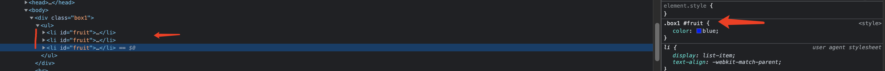
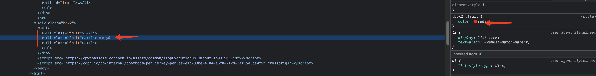

# 基本特性

> 基本 css 概念，以及相关属性规则

## 关于 `id `选择器在多个不同元素出现时的，渲染规则表现

`解释： id 选择器，是 css 中，元素唯一标识符，但是这是一个约定，如果在开发中，将多个不同元素应用在同一元素，则会雨露均沾，每个元素都会渲染一定的相同规则.`

**实际测试**:

1. 使用`id`选择器



2. 使用`class`



在线实例:

<iframe height="300" style="width: 100%;" scrolling="no" title="id #selector in multitype element" src="https://codepen.io/pachverb/embed/bGrjXbB?default-tab=html%2Cresult" frameborder="no" loading="lazy" allowtransparency="true" allowfullscreen="true">
  See the Pen <a href="https://codepen.io/pachverb/pen/bGrjXbB">
  id #selector in multitype element</a> by new/bird (<a href="https://codepen.io/pachverb">@pachverb</a>)
  on <a href="https://codepen.io">CodePen</a>.
</iframe>

## 布局

### 快捷居中

> flex 格式化上下文中，任何设置了`margin:auto`的元素，最终都会呈线水平垂直居中。w3c 解释，就是在在该格式化上下文中，空闲的空间都会自动分配到元素自动 margin 中去。

适用性：

> 个人觉着，对于不定高元素来说，是一个比较好的方案；水平垂直居中最一般的方式就是通过，为元素设置固定宽高的尺寸，然后设置 margin:auto。但是开发中，实际很少设置元素的固定高度的，一般都是自适应内容的。所以这种快捷方案，对于不设置固定高度的元素，也能实现居中，是一种比较可靠的方案。

在线体验：

<iframe height="300" style="width: 100%;" scrolling="no" title="flex+margin-auto-to-center" src="https://codepen.io/pachverb/embed/YzxOmmq?default-tab=html%2Cresult" frameborder="no" loading="lazy" allowtransparency="true" allowfullscreen="true">
  See the Pen <a href="https://codepen.io/pachverb/pen/YzxOmmq">
  flex+margin-auto-to-center</a> by new/bird (<a href="https://codepen.io/pachverb">@pachverb</a>)
  on <a href="https://codepen.io">CodePen</a>.
</iframe>

### 双飞翼布局

关键点:

1. 通过 margin-left 确定左右两列位置，在通过 middle 容器中的子容器的 paddin 和 margin 来空出左右两列宽度
2. 双飞翼布局不需要设置外层容器元素的内外边距
3. 双飞翼布局的关键点 margin-left 取值为百分比时，是以其父元素的宽度为基准的

线上体验：

<iframe height="300" style="width: 100%;" scrolling="no" title="双飞翼" src="https://codepen.io/pachverb/embed/LYjgPdb?default-tab=html%2Cresult" frameborder="no" loading="lazy" allowtransparency="true" allowfullscreen="true">
  See the Pen <a href="https://codepen.io/pachverb/pen/LYjgPdb">
  双飞翼</a> by new/bird (<a href="https://codepen.io/pachverb">@pachverb</a>)
  on <a href="https://codepen.io">CodePen</a>.
</iframe>

### 圣杯布局

> 对比双飞翼布局两种方式，两种布局体现形式别无二致，只是一个元素排布的问题，导致后期处理的创景比较多。

对于圣杯布局实现方式：

1. 浮动，这种同双飞翼布局一致
2. flex
3. grid 布局

具体实现：

- 在 container 中的三列设为浮动和相对定位(后面会用到)，center 要放在最前面，footer 清除浮动。
- 三列的左右两列分别定宽 200px 和 150px，中间部分 center 设置 100%撑满
- 这样因为浮动的关系，center 会占据整个 container，左右两块区域被挤下去了
- 接下来设置 left 的 margin-left: -100%;，让 left 回到上一行最左侧
- 但这会把 center 给遮住了，所以这时给外层的 container 设置 padding-left: 200px;padding-right: 150px;，给 left 和 right 空出位置
- 这时 left 并没有在最左侧，因为之前已经设置过相对定位，所以通过 left: -200px; 把 left 拉回最左侧
- 同样的，对于 right 区域，设置 margin-left: -150px; 把 right 拉回第一行
- 这时右侧空出了 150px 的空间，所以最后设置 right: -150px;把 right 区域拉到最右侧就行了

1. 浮动实现
在线 demo:
<iframe height="300" style="width: 100%;" scrolling="no" title="圣杯布局" src="https://codepen.io/pachverb/embed/zYdmrKa?default-tab=html%2Cresult" frameborder="no" loading="lazy" allowtransparency="true" allowfullscreen="true">
  See the Pen <a href="https://codepen.io/pachverb/pen/zYdmrKa">
  圣杯布局</a> by new/bird (<a href="https://codepen.io/pachverb">@pachverb</a>)
  on <a href="https://codepen.io">CodePen</a>.
</iframe>

2. 容器 flex 实现

- 顺序设置元素 left, center, right
- 给容器元素 container 设置 `display:flex`, 并且元素缩放控制 `flex： 1`
- 最后控制左右两列固定宽度设置即可.

在线体验:

<iframe height="300" style="width: 100%;" scrolling="no" title="圣杯布局-flex" src="https://codepen.io/pachverb/embed/qBXJZZd?default-tab=html%2Cresult" frameborder="no" loading="lazy" allowtransparency="true" allowfullscreen="true">
  See the Pen <a href="https://codepen.io/pachverb/pen/qBXJZZd">
  圣杯布局-flex</a> by new/bird (<a href="https://codepen.io/pachverb">@pachverb</a>)
  on <a href="https://codepen.io">CodePen</a>.
</iframe>

3. grid 实现

- 给 body 元素添加 display: grid;属性变成一个 grid(网格)
- 给 header 元素设置 grid-row: 1; 和 grid-column: 1/5; 意思是占据第一行网格的从第一条列网格线开始到第五条列网格线结束
- 给 footer 元素设置 grid-row: 1; 和 grid-column: 1/5; 意思是占据第三行网格的从第一条列网格线开始到第五条列网格线结束
- 给 left 元素设置 grid-row: 2; 和 grid-column: 1/2; 意思是占据第二行网格的从第一条列网格线开始到第二条列网格线结束
- 给 center 元素设置 grid-row: 2; 和 grid-column: 2/4; 意思是占据第二行网格的从第二条列网格线开始到第四条列网格线结束
- 给 right 元素设置 grid-row: 2; 和 grid-column: 4/5; 意思是占据第二行网格的从第四条列网格线开始到第五条列网格线结束-

在线 demo:

<iframe height="300" style="width: 100%;" scrolling="no" title="圣杯布局-grid" src="https://codepen.io/pachverb/embed/ExvdKXx?default-tab=html%2Cresult" frameborder="no" loading="lazy" allowtransparency="true" allowfullscreen="true">
  See the Pen <a href="https://codepen.io/pachverb/pen/ExvdKXx">
  圣杯布局-grid</a> by new/bird (<a href="https://codepen.io/pachverb">@pachverb</a>)
  on <a href="https://codepen.io">CodePen</a>.
</iframe>

### 网格布局(Grid)

> 网页格局，css 内的二位布局解决方案. 主要用于页面的局部布局和小型组件布局.
>
> > 网格布局定义: 网格是一组相交的水平线和垂直线，它定义了网格的列和行。我们可以将网格元素放置在与这些行和列相关的位置上

特点:

- 元素位置确定

1. 元素位置确定，使用行号，行名或标定一个网格区域来精确定位一个元素位置。网格同时还给出一个算法来控制未给出准确网格位置的元素。
2. 使用网格定义显示网格布局，但是根据规范它会处理你加在网格外面的内容，当必要时它会自动增加行和列，它会尽可能多的容纳所有的列。（创建额外的轨道来包含元素）

- 对齐控制

> 网格包含准确控制，包含在网格布中的元素的特点，以便我们可以控制一旦放置到网格区域中的物体对齐，以及整个网格如何对齐。

- 控制重叠

> 多个元素可以放在单元格中，或区域可以彼此重叠。然后使用 z-index 来控制重叠的优先级。

总结:

> 使用 Grid 并结合 flex 可以创建出不同的布局.

网格(grid)概念:

**网格容器**：在元素上使用，`display:grid`或`display: inline-grid`来创建一个网格布局。在网格容器中，所有直系子元素将会成为网格元素.
来看个例子:

**项目**: 这里的项目就是，让网格容器中的直系子元素.

css:

```css
/*
    伪代码
*/
.g-container {
  display: grid;
  ...;
}
```

html:

```html
<div class="g-container">
  <div class="item">
    <p>grid-1</p>
  </div>
  <div class="item"></div>
  <div class="item"></div>
  ....
</div>
```

例上面的例子，其中 `.g-container`容器，设置网格属性`display: grid`,此时的容器就是网格容器，容器中的`.item`就是项目.

:::warning 注意
项目中的元素，不能作为子元素。布局也并不会生效。
:::

**行和列**

> 网格布局，将容器划分为确定的"行"和"列"，其中在水平方向表示行，垂直方向表示列.

**单元格**

> 网格中的，行和列的交叉区域。

**网格线**

> 划分网格的线，水平的网格线划分出行，垂直的网格线划分列.

正常情况，n 行有，n+1 根水平网格线；m 列， 有 m+1 列垂直网格线.

对比 flex 布局:

1. flex 是轴线布局，只能指定项目相对轴线的位置，可以看做是*一维布局*.
2. grid 布局是将容器划分为‘行’和‘列’，产生单元格，然后指定项目所在的单元格，可以看做是*二维布局*, 相对 flex 布局，功能更加强大，布局也更加准确。

#### 容器属性

> grid 布局属性，分两类。一个是作用在容器上的，另一个是作用在项目上的。

先来说容器:

1. display 属性:`display: grid`指定一个容器设置网格布局。除使用`display: grid`，指定一个块级特性，也可以使块级元素表现为行内特点， `display: inline-grid`

现在使用一个网格布局，来实现一个矩阵

效果，在线 demo:

`display: inline-grid`

<iframe height="300" style="width: 100%;" scrolling="no" title="网格布局-容器属性display:grid(inline)" src="https://codepen.io/pachverb/embed/xxLyjaM?default-tab=html%2Cresult" frameborder="no" loading="lazy" allowtransparency="true" allowfullscreen="true">
  See the Pen <a href="https://codepen.io/pachverb/pen/xxLyjaM">
  网格布局-容器属性display:grid(inline)</a> by new/bird (<a href="https://codepen.io/pachverb">@pachverb</a>)
  on <a href="https://codepen.io">CodePen</a>.
</iframe>

`display: grid`

<iframe height="300" style="width: 100%;" scrolling="no" title="网格布局-容器属性display:grid(block)" src="https://codepen.io/pachverb/embed/RwZeyQw?default-tab=html%2Cresult" frameborder="no" loading="lazy" allowtransparency="true" allowfullscreen="true">
  See the Pen <a href="https://codepen.io/pachverb/pen/RwZeyQw">
  网格布局-容器属性display:grid(block)</a> by new/bird (<a href="https://codepen.io/pachverb">@pachverb</a>)
  on <a href="https://codepen.io">CodePen</a>.
</iframe>

::: tip 注意
设为网格布局以后，容器子元素（项目）的 float、display: inline-block、display: table-cell、vertical-align 和 column-\*等设置都将失效。
:::

2. **grid-template-columns 和 grid-template-rows**

> 指定了网格容器过后，需要定义行和列的宽度。
>
> > grid-template-columns,用于隐式创建列的宽度。mdn 官方的描述是： CSS 属性 grid-auto-columns 指定了隐式创建的网格纵向轨道（track）的宽度。
>
> > grid-template-rows, 用于隐式创建行的大小，mdn 官方的描述是: CSS 属性 grid-auto-rows 用于指定隐式创建的行轨道大小。

除了显示定义出确定的每个行和列的大小，也可以只定义部分尺寸.

::: details 提示
如果定位到某行中的网格元素没有使用 grid-template-rows 来指定大小，则会隐式创建 grid 轨道来保存它。这可能在显示定位到超出范围的行，或者由自动放置算法创建额外的行时发生。
:::

使用个值的场景示列代码:

```css
/* Keyword values */
grid-auto-rows: min-content;
grid-auto-rows: max-content;
grid-auto-rows: auto;

/* <length> values */
grid-auto-rows: 100px;
grid-auto-rows: 20cm;
grid-auto-rows: 50vmax;

/* <percentage> values */
grid-auto-rows: 10%;
grid-auto-rows: 33.3%;

/* <flex> values */
grid-auto-rows: 0.5fr;
grid-auto-rows: 3fr;

/* minmax() values */
grid-auto-rows: minmax(100px, auto);
grid-auto-rows: minmax(max-content, 2fr);
grid-auto-rows: minmax(20%, 80vmax);

/* multiple track-size values */ 上面，第一个列子就是使用多个值来定义行和列的尺寸的
grid-auto-rows: min-content max-content auto;
grid-auto-rows: 100px 150px 390px;
grid-auto-rows: 10% 33.3%;
grid-auto-rows: 0.5fr 3fr 1fr;
grid-auto-rows: minmax(100px, auto) minmax(max-content, 2fr) minmax(20%, 80vmax);
grid-auto-rows: 100px minmax(100px, auto) 10% 0.5fr fit-content(400px);

/* Global values */
grid-auto-rows: inherit;
grid-auto-rows: initial;
grid-auto-rows: unset;
```

使用百分比, 定义行或列的宽度

<iframe height="300" style="width: 100%;" scrolling="no" title="grid[-template-rows/columns]-values(px/percentice)-px" src="https://codepen.io/pachverb/embed/xxLyzVv?default-tab=html%2Cresult" frameborder="no" loading="lazy" allowtransparency="true" allowfullscreen="true">
  See the Pen <a href="https://codepen.io/pachverb/pen/xxLyzVv">
  grid[-template-rows/columns]-values(px/percentice)-px</a> by new/bird (<a href="https://codepen.io/pachverb">@pachverb</a>)
  on <a href="https://codepen.io">CodePen</a>.
</iframe>

小技巧: 上面在定义行或列的宽度时，会重复定义某个单位值，使用`repeat`函数，来简化此过程。

> repeat, 使用说明，该函数接收两个参数，第一重复次数，第二个参数接收重复的值，模式。

**`repeat`使用示范**

改进上面的列子, 结果，查看 less 部分示列.

重复某个值:

```css
repeat: (3, calc(100% / 3));
```

<iframe height="300" style="width: 100%;" scrolling="no" title="grid[-template-rows/columns]-values(px/percentice)-px" src="https://codepen.io/pachverb/embed/xxLyzVv?default-tab=html%2Cresult" frameborder="no" loading="lazy" allowtransparency="true" allowfullscreen="true">
  See the Pen <a href="https://codepen.io/pachverb/pen/xxLyzVv">
  grid[-template-rows/columns]-values(px/percentice)-px</a> by new/bird (<a href="https://codepen.io/pachverb">@pachverb</a>)
  on <a href="https://codepen.io">CodePen</a>.
</iframe>

重复一组值:

```css
... repeat(2, 50px 50px 50px) ...;
```

<iframe height="300" style="width: 100%;" scrolling="no" title="网格布局先关之-repeat" src="https://codepen.io/pachverb/embed/XWaxYgL?default-tab=html%2Cresult" frameborder="no" loading="lazy" allowtransparency="true" allowfullscreen="true">
  See the Pen <a href="https://codepen.io/pachverb/pen/XWaxYgL">
  网格布局先关之-repeat</a> by new/bird (<a href="https://codepen.io/pachverb">@pachverb</a>)
  on <a href="https://codepen.io">CodePen</a>.
</iframe>

**auto-fill 关键字**

> repeat，次数也可以使用 auto-fill 关键字，有时候网格容器的大小是不确定的，但是单元格的大小固定，此时，希望尽可能容纳多的单元格，可以使用 auto-fill 自动填充.

```css
grid-tempate-columns: repeat(auto-fill, 100px);
```

<iframe height="300" style="width: 100%;" scrolling="no" title="网格布局-auto-fill" src="https://codepen.io/pachverb/embed/ExvdRLa?default-tab=html%2Cresult" frameborder="no" loading="lazy" allowtransparency="true" allowfullscreen="true">
  See the Pen <a href="https://codepen.io/pachverb/pen/ExvdRLa">
  网格布局-auto-fill</a> by new/bird (<a href="https://codepen.io/pachverb">@pachverb</a>)
  on <a href="https://codepen.io">CodePen</a>.
</iframe>

**fr 关键字**

> 为了方便表示比列关系, 可以使用 fr 关键字，作为网格轨道值的单位。如果两列的宽度为 1fr 和 2fr, 则前后两者的列宽比列为 1:2

基本使用:

<iframe height="300" style="width: 100%;" scrolling="no" title="grid-fr" src="https://codepen.io/pachverb/embed/wvqQWrN?default-tab=html%2Cresult" frameborder="no" loading="lazy" allowtransparency="true" allowfullscreen="true">
  See the Pen <a href="https://codepen.io/pachverb/pen/wvqQWrN">
  grid-fr</a> by new/bird (<a href="https://codepen.io/pachverb">@pachverb</a>)
  on <a href="https://codepen.io">CodePen</a>.
</iframe>

和绝对单位组合使用, 比如 pixel

```
...
grid-template-columns: 150px 1fr 2fr;
...
```

<iframe height="300" style="width: 100%;" scrolling="no" title="grid-fr-2" src="https://codepen.io/pachverb/embed/JjyeKar?default-tab=html%2Cresult" frameborder="no" loading="lazy" allowtransparency="true" allowfullscreen="true">
  See the Pen <a href="https://codepen.io/pachverb/pen/JjyeKar">
  grid-fr-2</a> by new/bird (<a href="https://codepen.io/pachverb">@pachverb</a>)
  on <a href="https://codepen.io">CodePen</a>.
</iframe>

**minmax()关键字**
`minmax`产生一个长度范围，表示长度就在这个范围中，它接收两个参数，分别是最小和最大值。例如， minmax(100px, 1fr),就表示长度在 100px 和 1fr 之间.

使用 minmax,来实现一个圣杯布局,

<iframe height="300" style="width: 100%;" scrolling="no" title="grid-minmax" src="https://codepen.io/pachverb/embed/RwZqGrd?default-tab=html%2Cresult" frameborder="no" loading="lazy" allowtransparency="true" allowfullscreen="true">
  See the Pen <a href="https://codepen.io/pachverb/pen/RwZqGrd">
  grid-minmax</a> by new/bird (<a href="https://codepen.io/pachverb">@pachverb</a>)
  on <a href="https://codepen.io">CodePen</a>.
</iframe>

:::tip 注意
类似实现一个双飞翼或者圣杯布局。
但是没有完全体现出圣杯布局和双飞翼布局内容优先加载的特点.
:::

**auto 关键字**
表示由浏览器自己计算长度

```
grid-template-columns: 100px auto 100px;
```

上面的代码，中间的列表示尺寸为 auto, 基本占据该列最大单元格宽度，除非设置该单元格最小宽度`min-width`，否则就是自动 auto 计算的最大单元格尺寸.

auto: 实现圣杯布局

<iframe height="300" style="width: 100%;" scrolling="no" title="grid-auto" src="https://codepen.io/pachverb/embed/vYJQXro?default-tab=html%2Cresult" frameborder="no" loading="lazy" allowtransparency="true" allowfullscreen="true">
  See the Pen <a href="https://codepen.io/pachverb/pen/vYJQXro">
  grid-auto</a> by new/bird (<a href="https://codepen.io/pachverb">@pachverb</a>)
  on <a href="https://codepen.io">CodePen</a>.
</iframe>

**网格线名称**

> 使用网格属性`grid-template-columns`和`grid-template-rows`设置网格尺寸是，还可以在属性值中，附带网格线名称. 名称使用 `[]`包裹. 且每一个网格线可以有多个名称, [c4 col4], 多个值之间空格分离.

```css
grid-template-columns: [c1] 100px [c2] 100px [c3] 100px [c4];
/**/
grid-template-rows: [r1] 100px r2 100px r3 100px r4;
```

**网格布局实例**

1. 双飞翼布局
   ....
2. 圣杯布局
   ....
3. 两栏布局
   > 两栏布局，且左右自适应

```
grid-template-columns: 70% 30%;
```

<iframe height="300" style="width: 100%;" scrolling="no" title="grid-double-layout" src="https://codepen.io/pachverb/embed/ExvOgBO?default-tab=html%2Cresult" frameborder="no" loading="lazy" allowtransparency="true" allowfullscreen="true">
  See the Pen <a href="https://codepen.io/pachverb/pen/ExvOgBO">
  grid-double-layout</a> by new/bird (<a href="https://codepen.io/pachverb">@pachverb</a>)
  on <a href="https://codepen.io">CodePen</a>.
</iframe>
1. 十二列布局
一行代码实现十二列布局   
```
grid-template-columns: repeat(12, auto)
```

<iframe height="300" style="width: 100%;" scrolling="no" title="grid-12-columns-layout" src="https://codepen.io/pachverb/embed/jOLQVOa?default-tab=html%2Cresult" frameborder="no" loading="lazy" allowtransparency="true" allowfullscreen="true">
  See the Pen <a href="https://codepen.io/pachverb/pen/jOLQVOa">
  grid-12-columns-layout</a> by new/bird (<a href="https://codepen.io/pachverb">@pachverb</a>)
  on <a href="https://codepen.io">CodePen</a>.
</iframe>

3.  **grid-row-gap 属性，grid-column-gap 属性，grid-gap 属性**

grid-row-cap 设置行与行之间的间隔
grid-column-cap 设置列与列之间的间隔

例如：

```css
.container {
  griid-row-gap: 20px;
  grid-column-gap: 20px;
}
```

当然，上面的两个属性也可以简写为: `grid-gap: 20px 20px;`, 同时，第二个值，也可以省略。如果省略第二个值，则表示第二个值和第一个值相同。
例子:

```css
grid-gap: 20px 20px 或
grid-gap: 20px
```

:::tip 注意
根据最新标准，行列间距属性的前缀可以省略。即，grid-，现在的行列属性，表示为 `row-gap`, `column-gap`, 缩写属性，`gap`.
:::

在线列子:

<iframe height="300" style="width: 100%;" scrolling="no" title="grid-gap" src="https://codepen.io/pachverb/embed/yLoQVKQ?default-tab=html%2Cresult" frameborder="no" loading="lazy" allowtransparency="true" allowfullscreen="true">
  See the Pen <a href="https://codepen.io/pachverb/pen/yLoQVKQ">
  grid-gap</a> by new/bird (<a href="https://codepen.io/pachverb">@pachverb</a>)
  on <a href="https://codepen.io">CodePen</a>.
</iframe>

4. **grid-template-areas**

> 网格布局区域定义，一个区域由一个或多个单元格组成. grid-template-areas 用于定义区域

```css
.container {
  display: grid;
  grid-template-columns: repeat(3, 100px);
  grid-template-areas: "a b c" "d e f" "g h i";
}
```

上面的网格，划分了一个 3 x 3 的布局。这个网格由 a 到 i 连续的 9 个区域组成。分别对应 9 个单元格。

多个单元格合并到一个区域,
其中头部区域是 header, 内容区是 main, 页脚区是 footer.

```
grid-template-areas: "header header header" "main main main" "footer footer footer";
```

如果某个区域不需要，可以利用 `.` 代替, 表示该区域没有使用，不含任何单元格。

:::warning 注意
注意，区域的命名会影响到网格线。每个区域的起始网格线，会自动命名为区域名-start，终止网格线自动命名为区域名-end。

比如，区域名为 header，则起始位置的水平网格线和垂直网格线叫做 header-start，终止位置的水平网格线和垂直网格线叫做 header-end。
:::

在线列子:

<iframe height="300" style="width: 100%;" scrolling="no" title="grid-areas" src="https://codepen.io/pachverb/embed/qBXQRNR?default-tab=html%2Cresult" frameborder="no" loading="lazy" allowtransparency="true" allowfullscreen="true">
  See the Pen <a href="https://codepen.io/pachverb/pen/qBXQRNR">
  grid-areas</a> by new/bird (<a href="https://codepen.io/pachverb">@pachverb</a>)
  on <a href="https://codepen.io">CodePen</a>.
</iframe>

grid-template-areas 和 grid-area 结合使用:

<iframe height="300" style="width: 100%;" scrolling="no" title="grid-area-pro" src="https://codepen.io/pachverb/embed/rNzQjoW?default-tab=html%2Cresult" frameborder="no" loading="lazy" allowtransparency="true" allowfullscreen="true">
  See the Pen <a href="https://codepen.io/pachverb/pen/rNzQjoW">
  grid-area-pro</a> by new/bird (<a href="https://codepen.io/pachverb">@pachverb</a>)
  on <a href="https://codepen.io">CodePen</a>.
</iframe>

**grid-auto-flow**

> 设置网格容器内，项目的排列顺序. 默认划分好网格后，项目按照 "先行后列"的顺序排列.
> `grid-auto-flow: row | column | row dense | column dense`

默认 row, 即"先行后列"排列单元格

...

现在设置，“先列后行”, `column`

在线 demo：

<iframe height="300" style="width: 100%;" scrolling="no" title="Untitled" src="https://codepen.io/pachverb/embed/vYJvBeL?default-tab=html%2Cresult" frameborder="no" loading="lazy" allowtransparency="true" allowfullscreen="true">
  See the Pen <a href="https://codepen.io/pachverb/pen/vYJvBeL">
  Untitled</a> by new/bird (<a href="https://codepen.io/pachverb">@pachverb</a>)
  on <a href="https://codepen.io">CodePen</a>.
</iframe>

除了，设置,`row`, `column`两个值，还可以指定 `row dense`, `column dense`. 主要用于，某些项目指定位置后，剩下的项目应该怎么自动放置。这两个值，还附带一个紧密排列含义，尽量不出现空格.

看一个列子:

> 默认下面的布局设置，在默认的 grid-auto-flow: row 排列下， 且第一个项目，和第一个项目各占两个单元格位置.
> 则，第一个项目后面后空出.
> 这是项目 3 跟随第二个项目排列，所以会空出一个单元格.
> 现在设置 grid-auto-flow: row dense, 先行后列 排列元素，并且元素尽量紧密排列，不出现空格。

在线列子:

> 下面的列子描述了两种情况. `row dense `, `column dense`

<iframe height="300" style="width: 100%;" scrolling="no" title="grid-auto-flow-row dense" src="https://codepen.io/pachverb/embed/PoKXYMO?default-tab=html%2Cresult" frameborder="no" loading="lazy" allowtransparency="true" allowfullscreen="true">
  See the Pen <a href="https://codepen.io/pachverb/pen/PoKXYMO">
  grid-auto-flow-row dense</a> by new/bird (<a href="https://codepen.io/pachverb">@pachverb</a>)
  on <a href="https://codepen.io">CodePen</a>.
</iframe>

**justify-items, align-items, place-items**

justify-item, 与 align-items 设置单元格内容的水平与垂直对齐方式.

::: warning 注意
目前，Flexbox 和 CSS 网格布局支持此属性。在 Flexbox 中，它控制十字轴上项目的对齐方式，在网格布局中，它控制块轴上项目的对齐方式。而不是对单元格内的内容对齐方式，目标是项目对齐。

:::

place-items: 是上上面两种的结合简写方式

语法:

```
justify-items: start | end | center | strech
align-items: start | end | center | strech

place-items: <align-items>  <justify-items>
```

两种写法一致， 各个值的含义:

- start: 对齐单元格的起始位置
- end: 对齐单元格的结束边缘
- center: 居中对齐单元格内容
- strech: 拉伸沾满整个单元格

在线例子:

<iframe height="300" style="width: 100%;" scrolling="no" title="grid-place-items" src="https://codepen.io/pachverb/embed/MWvZWqw?default-tab=html%2Cresult" frameborder="no" loading="lazy" allowtransparency="true" allowfullscreen="true">
  See the Pen <a href="https://codepen.io/pachverb/pen/MWvZWqw">
  grid-place-items</a> by new/bird (<a href="https://codepen.io/pachverb">@pachverb</a>)
  on <a href="https://codepen.io">CodePen</a>.
</iframe>

**justify-content, align-content, place-content**

> > justify-content 属性是*整个内容区域*在容器里面的水平位置（左中右），align-content 属性是整个内容区域的垂直位置. place-content 是前面两者的简写. 该属性同时，也可以用来控制项目在容器内对齐方式.

语法:

```
 justify-content: start | end | center | stretch | space-around | space-between | space-evenly;
  align-content: start | end | center | stretch | space-around | space-between | space-evenly;
  place-content: <align-content> <justify-content>
```

值解释:

- start: 对齐容器的结束边框。
- center: 容器内部居中。
- stretch: 项目大小没有指定时，拉伸占据整个网格容器。(项目没有指定大小就是 fr, auto 等情况)
- space-around: 每个项目两侧的间隔相等。所以，项目之间的间隔比项目与容器边框的间隔大一倍。
- space-between: 项目与项目的间隔相等，项目与容器边框之间没有间隔。
- space-evenly: 项目与项目的间隔相等，项目与容器边框之间也是同样长度的间隔。

<iframe height="300" style="width: 100%;" scrolling="no" title="Untitled" src="https://codepen.io/pachverb/embed/RwZENLd?default-tab=html%2Cresult" frameborder="no" loading="lazy" allowtransparency="true" allowfullscreen="true">
  See the Pen <a href="https://codepen.io/pachverb/pen/RwZENLd">
  Untitled</a> by new/bird (<a href="https://codepen.io/pachverb">@pachverb</a>)
  on <a href="https://codepen.io">CodePen</a>.
</iframe>

**grid-auto-columns 属性，
grid-auto-rows 属性**

有时候，一些项目的指定位置，在现有网格的外部。比如网格只有 3 列，但是某一个项目指定在第 5 行。这时，浏览器会自动生成多余的网格，以便放置项目。

grid-auto-columns 属性和 grid-auto-rows 属性用来设置，浏览器自动创建的多余网格的列宽和行高。它们的写法与 grid-template-columns 和 grid-template-rows 完全相同。如果不指定这两个属性，浏览器完全根据单元格内容的大小，决定新增网格的列宽和行高。

<iframe height="300" style="width: 100%;" scrolling="no" title="grid-grid-auto-rows/columns" src="https://codepen.io/pachverb/embed/porqvYw?default-tab=html%2Cresult" frameborder="no" loading="lazy" allowtransparency="true" allowfullscreen="true">
  See the Pen <a href="https://codepen.io/pachverb/pen/porqvYw">
  grid-grid-auto-rows/columns</a> by new/bird (<a href="https://codepen.io/pachverb">@pachverb</a>)
  on <a href="https://codepen.io">CodePen</a>.
</iframe>

**grid-template 属性，grid 属性**
grid-template 属性是 grid-template-columns、grid-template-rows 和 grid-template-areas 这三个属性的合并简写形式。

grid 属性是 grid-template-rows、grid-template-columns、grid-template-areas、 grid-auto-rows、grid-auto-columns、grid-auto-flow 这六个属性的合并简写形式

:::tip 提示
从易读易写的角度考虑，还是建议不要合并属性，所以这里就不详细介绍这两个属性了。
:::

#### 项目属性

**1.grid-column-start, grid-column-end, grid-row-start, grid-row-end**

> 指定当个项目在所在得网格单元格中的位置,指定方法是指定项目的四个边框，分别定为在那根网格线上。

```
grid-column-start: 左边框所在的垂直网格线上。
grid-column-end: 右边框所在的垂直网格上.
grid-row-start: 上边框所在的水平网格线
grid-row-end: 下边框所在的水平网格线.
```

使用上面的属性:

<iframe height="300" style="width: 100%;" scrolling="no" title="Item-grid-column/row-start/end" src="https://codepen.io/pachverb/embed/QWMPdor?default-tab=html%2Cresult" frameborder="no" loading="lazy" allowtransparency="true" allowfullscreen="true">
  See the Pen <a href="https://codepen.io/pachverb/pen/QWMPdor">
  Item-grid-column/row-start/end</a> by new/bird (<a href="https://codepen.io/pachverb">@pachverb</a>)
  on <a href="https://codepen.io">CodePen</a>.
</iframe>

分析:
设置 第一个单元格位置, grid-column-start: 2, grid-column-end: 4. 如果按照 grid-auto-flow: 网格中第一个位置，会空余出多余位置. 再次设置 grid-auto-flow: row dense, 使得第二个项目充分利用网格第一个位置， 因此第二个项目被放置到项目一。如果设置网格项目排列顺序，column, 则会多余出的空间，也就是第九个项目被挤出网格中，由浏览器从新分配空间.

使用四个边框定位:

<iframe height="300" style="width: 100%;" scrolling="no" title="设置四个边框的位置-grid-column/row-start/end" src="https://codepen.io/pachverb/embed/xxLeqgZ?default-tab=html%2Cresult" frameborder="no" loading="lazy" allowtransparency="true" allowfullscreen="true">
  See the Pen <a href="https://codepen.io/pachverb/pen/xxLeqgZ">
  设置四个边框的位置-grid-column/row-start/end</a> by new/bird (<a href="https://codepen.io/pachverb">@pachverb</a>)
  on <a href="https://codepen.io">CodePen</a>.
</iframe>

使用网格线名字: grid-template-area, grid-column/row-start/end, 实现上一个类似例子:

<iframe height="300" style="width: 100%;" scrolling="no" title="区域定位-grid-template-area" src="https://codepen.io/pachverb/embed/rNzbyza?default-tab=html%2Cresult" frameborder="no" loading="lazy" allowtransparency="true" allowfullscreen="true">
  See the Pen <a href="https://codepen.io/pachverb/pen/rNzbyza">
  区域定位-grid-template-area</a> by new/bird (<a href="https://codepen.io/pachverb">@pachverb</a>)
  on <a href="https://codepen.io">CodePen</a>.
</iframe>

位置属性，使用跨行关键字 `span [number]`, 表示 左右边框（上下边框）之间跨越多少个网格。

<iframe height="300" style="width: 100%;" scrolling="no" title="grid-column/row-start/end: span [number]" src="https://codepen.io/pachverb/embed/WNEWpKm?default-tab=html%2Cresult" frameborder="no" loading="lazy" allowtransparency="true" allowfullscreen="true">
  See the Pen <a href="https://codepen.io/pachverb/pen/WNEWpKm">
  grid-column/row-start/end: span [number]</a> by new/bird (<a href="https://codepen.io/pachverb">@pachverb</a>)
  on <a href="https://codepen.io">CodePen</a>.
</iframe>

::: tip 提示
通过 span 关键字来控制项目位置，实际并不能改变项目原来所在单元格，仅仅通过改变项目单元格左右边框间距，来达到改变项目大小为目的。

使用这四个属性，如果产生了项目的重叠，则使用 z-index 属性指定项目的重叠顺序。
:::

**grid-column, grid-row**

> grid-column 属性是 grid-column-start 和 grid-column-end 的合并简写形式，grid-row 属性是 grid-row-start 属性和 grid-row-end 的合并简写形式。

语法:

```css
grid-column: <start-line> / <end-line>;
grid-row: <start-line> / <end-line>;
```

使用简写属性，结合 span 关键字

<iframe height="300" style="width: 100%;" scrolling="no" title="grid-row/column----span" src="https://codepen.io/pachverb/embed/PoKgpvx?default-tab=html%2Cresult" frameborder="no" loading="lazy" allowtransparency="true" allowfullscreen="true">
  See the Pen <a href="https://codepen.io/pachverb/pen/PoKgpvx">
  grid-row/column----span</a> by new/bird (<a href="https://codepen.io/pachverb">@pachverb</a>)
  on <a href="https://codepen.io">CodePen</a>.
</iframe>

代码中:

```css
grid-column: 1 / span 2;
grid-row: 1 / span 2;

// 等价于
grid-column-start: 1;
grid-column-end: 3;
grid-row-start: 1;
grid-row-end: 3;

// 使用简写
grid-column: 1 / 3;
grid-row: 1 / 3;
```

::: tip
斜杠以及后面的部分可以省略，默认跨越一个网格。

即
grid-row: 1
grid-column: 1
:::

**grid-area**

> grid-area 属性指定项目放在哪一个区域。grid-area 属性还可用作 grid-row-start、grid-column-start、grid-row-end、grid-column-end 的合并简写形式，直接指定项目的位置。

用于指定元素所在区域:

`grid-area: [区域]`

<iframe height="300" style="width: 100%;" scrolling="no" title="grid-area" src="https://codepen.io/pachverb/embed/vYJMmZQ?default-tab=html%2Cresult" frameborder="no" loading="lazy" allowtransparency="true" allowfullscreen="true">
  See the Pen <a href="https://codepen.io/pachverb/pen/vYJMmZQ">
  grid-area</a> by new/bird (<a href="https://codepen.io/pachverb">@pachverb</a>)
  on <a href="https://codepen.io">CodePen</a>.
</iframe>

作为简写: 语法

```css
grid-area: <row-start> / <column-start> / <row-end> / <column-end>;
```

比如:
项目水平/垂直起始网格线在第一个网格线位置，垂直结束位置在水平/垂直第三个水平线。

```css
grid-area: 1 / 1 / 3 / 3;
```

**justify-self 属性，align-self 属性，place-self 属性**

> justify-self 属性设置单元格内容的水平位置（左中右），跟 justify-items 属性的用法完全一致，但只作用于单个项目。
> align-self 属性设置单元格内容的垂直位置（上中下），跟 align-items 属性的用法完全一致，也是只作用于单个项目。
> place-self 作为上面两个属性简写

语法:

```css
justify-self: start | end | center | stretch;
align-self: start | end | center | stretch;
place-self: <align-self> <justify-self>;
```

取值说明:

- start：对齐单元格的起始边缘。
- end：对齐单元格的结束边缘。
- center：单元格内部居中。
- stretch：拉伸，占满单元格的整个宽度（默认值）。

使用属性:

<iframe height="300" style="width: 100%;" scrolling="no" title="place-self" src="https://codepen.io/pachverb/embed/GRvLmQa?default-tab=html%2Cresult" frameborder="no" loading="lazy" allowtransparency="true" allowfullscreen="true">
  See the Pen <a href="https://codepen.io/pachverb/pen/GRvLmQa">
  place-self</a> by new/bird (<a href="https://codepen.io/pachverb">@pachverb</a>)
  on <a href="https://codepen.io">CodePen</a>.
</iframe>

这里仍然是设置第一个单元格内，项目的位置。

::: tip
在划分网格时，元素与网格一一对于。但是，单元格是虚拟的网格，区别于容器内的实际 html 元素，因此在设置单元格的内容相对位置时，每一个元素被当作内容看待，相对位置而是取决于虚拟的单元格。
:::

<iframe height="300" style="width: 100%;" scrolling="no" title="place-self" src="https://codepen.io/pachverb/embed/GRvLmQa?default-tab=html%2Cresult" frameborder="no" loading="lazy" allowtransparency="true" allowfullscreen="true">
  See the Pen <a href="https://codepen.io/pachverb/pen/GRvLmQa">
  place-self</a> by new/bird (<a href="https://codepen.io/pachverb">@pachverb</a>)
  on <a href="https://codepen.io">CodePen</a>.
</iframe>

**参考**

- [MDN-Grid](https://developer.mozilla.org/zh-CN/docs/Glossary/Grid)
- [CSS Grid 网格布局教程-阮一峰](https://www.ruanyifeng.com/blog/2019/03/grid-layout-tutorial.html)

### css 瀑布流布局

关键点:

- column-count: 元素内容被划分为最佳列数
- break-inside: 避免在元素内部插入分页符

<iframe height="300" style="width: 100%;" scrolling="no" title="css-瀑布流" src="https://codepen.io/pachverb/embed/abyxwYx?default-tab=html%2Cresult" frameborder="no" loading="lazy" allowtransparency="true" allowfullscreen="true">
  See the Pen <a href="https://codepen.io/pachverb/pen/abyxwYx">
  css-瀑布流</a> by new/bird (<a href="https://codepen.io/pachverb">@pachverb</a>)
  on <a href="https://codepen.io">CodePen</a>.
</iframe>
