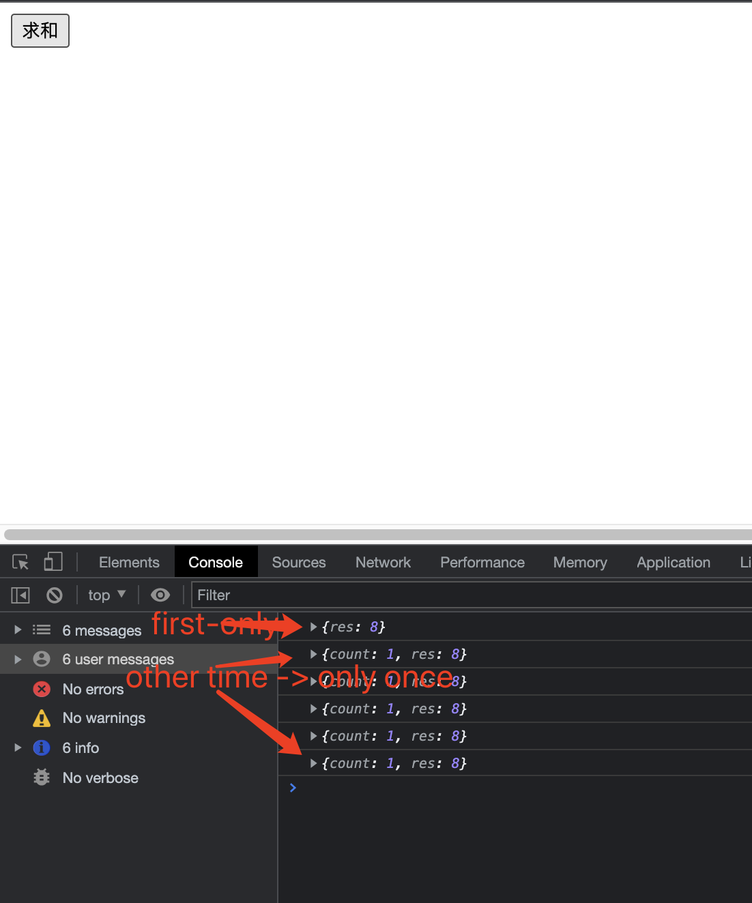

## 编程范式

> 聚焦于 javascript 实现的函数式编程范式.

### 函数式编程范式

> 谈及历史，世界上最古老的语言 Lisp 就是基于这一范式。FP 暗示了一种不同的编写程序的方法，这有时很难做到
> 学习。在大多数语言中，编程是以命令式的方式完成的:一个程序就是一个语句序列，以指定的方式执行，并获得期望的结果。通过创建对象并对其进行操作，这通常会修改对象他们自己。FP 的基础是通过计算表达式来产生预期的结果。函数组合在一起。在 FP 中，通常将函数作为参数传递给其他函数，或作为某些计算的结果返回)，不使用循环(选择 for 并跳过副作用(如修改对象或全局变量)。
>
> > 换句话说，《外交政策》关注的是应该做什么，而不是怎么做。您不必担心循环或数组，而是在更高的层次上工作，考虑您需要做的。在习惯了这种风格之后，您会发现您的代码变得更简单，更短，更优雅，并且可以很容易地测试和调试。

### 关于函数式

- 函数式范式并非学术象牙塔，而是有实际的理论支撑，著名的(lambda calculus)以证明理论计算机科学的一个重要结果, 同时作为函数式的理论支撑。
- FP 不是面向对象编程(OOP)的对立面:同样，它也不是选择声明式或命令式编程方式的一种情况。可以通其他编程方式组合.
- FP 并不复杂，不同复杂情况，只是使用的语言不同。同样，我们也可以在 js 中，来表述 FP 特性。

**相关**

值得一提的是，一些现代框架，如 React+Redux 的组合，包括 FP 的想法。例如，在 React 中，据说视图(无论用户在给定时刻看到什么)都是当前状态的函数。即使用函数去计算状态，然后作用于视图，及时反馈给用户。

类似地，在 Redux 中，您可以获得由 reducer 处理的操作的概念（类似 vuex 的 action）。一种行为提供一些数据，reducer 是一个函数，它为应用程序以功能方式脱离当前状态和提供的数据。

### 通用范式特点:

> 不管是函数式编程还是其他编程范式，都应该遵守的规则。

- 模块化: 程序的功能应该分成独立的模块，每个模块都包含执行某个方面所需的内容程序功能。模块或功能的更改不应影响其余部分代码
- 可读性高: 程序的读者应该能够辨别它的组件，它们的功能，并理解它们之间的关系.这与可维护性高度相关.
- 方便测试: 单元测试尝试程序小部分代码测试，以验证与其他代码的独立性. 函数式编程应简化编写单元测试代码的工作量。
- 可扩展: 程序有一天需要维护，可能会添加新功能。这些变化的影响应该很小，不会影响原始代码的结构和数据流。小的改变不应该意味着对代码进行大规模、严肃的重构。
- 可重用：代码重用的目标是节省资源、时间、金钱和减少冗余，利用以前编写的代码。有一些有助于实现这一目标的特性，例如模块化，加上高内聚（模块中的所有部分都属于一起），低耦合（模块相互独立），关注点分离（部分应尽可能少地在功能上重叠）和信息隐藏（模块中的内部更改不应影响系统的其余部分）。

思考： 函数式范式，是否能够提供上述特点。

### 函数式特性：

- 在 FP 中，目标是编写单独的独立函数，将它们连接起来，共同产生最终结果。（模块化）
- 以函数式风格编写的程序通常更简洁、更短、更简洁。更容易理解（可读性）。
- 函数可以自行测试，而 FP 代码在这方面具有优势。（可测试）
- 可以在其他程序中重用函数，因为它们独立存在，而不是取决于系统的其余部分。最实用的程序（可扩展）
- 函数式代码没有副作用，这意味着您可以理解通过研究一个函数的目标，而不必考虑其余的程序。（可复用）

::: tip
习惯了 FP 方式，代码就会变得更容易理解和更容易延长。所以，这五个特性似乎都可以用 FP 来保证！
:::

### 函数式缺陷

- 但是，让我们争取一点平衡。使用 FP 不是灵丹妙药自动使您的代码更好。一些 FP 解决方案实际上很棘手——而且有开发人员在编写代码时表现出极大的喜悦，然后询问这有什么作用？如果你不小心，你的代码可能会变成只写的，几乎不可能维护......可以理解为，无可扩展和无可重用！

- 另一个缺点：您可能会发现很难找到精通 FP 的开发人员。 （快的问题：你见过多少函数式程序员求职招聘广告？）今天的大部分 JS 代码都是以命令式的、非函数式的方式编写的，并且大多数编码人员
  习惯了这种工作方式。对于某些人来说，不得不换用不同编程范式，可能会被证明是一个无法逾越的障碍。

最后，如果完全尝试 FP，可能会发现与 JS 不一致，而且很简单任务可能变得难以完成。正如我们一开始所说，我们宁愿选择 Sorta FP，所以我们不会彻底拒绝任何不是 100% FP 的 JS 功能。我们想使用 FP 来简化我们的编码，而不是让它变得更复杂！FP 编程的确能够带来通用编程方式优点，特性。但是在一些情况完全函数式风格，会使程序无法往下进行。解决方案就是，包容其他编程方式特点，组合各自特点来实现。

### javascript 函数式

> 通常讨论函数式语言时，不包括 js。然而，一些古老语言，像 Haskell，同样是没有 FP 语言的精确定义或此类语言应该具备的一组精确特性。总的来说，认定一种语言是否是函数式，应该看这种语言是否支持 FP 相关的常见编程风格。
>
> > JS 可以
> > 被认为是功能性的，因为有几个特征，例如一等的 Fucntion，
> > 匿名函数、递归和闭包。在另一
> > 一方面，JS 有很多非 FP 方面，例如副作用、可变对象（动态对象）和
> > 递归的实际限制。因此，当以函数式方式编程时，我们将采用
> > 利用所有相关的 JS 语言特性.

### js 命名历史

> Mocha--> LiveScript--> Javascript

### js 用于函数式的一些特性

- 函数作为一等对象(Function as first-class object)
- 递归: 递归对算法设计有很大帮助。通过使用递归，可以做到没有任何 while 或 for 循环
- 闭包: 闭包是实现数据隐藏的一种方式（使用私有变量），这导致模块和其他不错的功能。关键概念是当你定义一个函数时，它可以不仅引用它自己的局部变量，而且引用上下文之外的所有东西
  功能：
- 展开运算符

递归一点:

> 这是开发算法的最有效工具，也是解决大类问题的有力助手
> 的问题。这个想法是一个函数可以在某个时刻调用自己，并且当那个调用是
> 完成，继续处理它收到的任何结果。这通常很有帮助
> 对于某些类别的问题或定义。最常引用的例子是阶乘

设计方法,实现阶乘: 关键点

- 非负正数
- n = 0, n! = 1;
- n > 0, n! = n \* (n - 1)!

```js
// 设计: 计算n!阶乘
function fact(n) {
  if (n === 0) {
    return 1;
  }
  return n * fact(n - 1);
}
```

闭包一点: 闭包是实现数据隐藏的一种方式（使用私有变量），这导致模块和其他不错的功能。关键概念是当你定义一个函数时，它可以不仅引用它自己的局部变量，而且引用上下文之外的所有东西

例子:

```js
// 基于这个例子，可以理解。闭包算是对函数作用域的延续继承。
function newCounter() {
  let count = 0;

  return function () {
    return count++;
  };
}

let nc = newCounter();

nc(); // 1
nc(); // 2
nc(); // 3
```

::: tip
闭包算是 js 函数式一范式中，不好的特性点。因为它违背了函数式无副作用特点.
:::

遗留任务点:

- 爬升阶乘：我们的阶乘实现开始乘以 n，然后乘以
  n-1，然后是 n-2，依此类推，我们可以称之为向下的方式。你能写一个新的
  阶乘函数的版本，会向上循环吗？

- 类作为第一对象，为什么, 思考如下一段代码

```js
const makeSaluteClass = (term) =>
  class {
    constructor(x) {
      this.x = x;
    }
    salute(y) {
      console.log(`this${this.x} says ${term} to ${y}`);
    }
  };

const Spanish = makeSaluteClass("HOLA");
new Spanish("ALFA").salute("BETA"); // HOLA says ALFA to BETA

new (makeSaluteClass("HELLO"))("GAMMA").salute("DELTA"); // HELLO says GAMMA to DELTA;

const fullSaltute = (c, x, y) => new c(x).salute(y);
const French = makeSaluteClass("BON JOUR");
fullSalute(French, "EPSILON", "ZETA"); // EPSILON says  BON JOUR to ZETA
```

## 思考函数式

> 从一个 web 业务开始，引发对函数式的应用思考。现在是对一个电商网站的商品进行支付的按钮实现，在此之前，还必须避免用户重复点击按钮，而导致再次扣费。

**解决方案一**：

（求佛方式，玩笑说法）此方案就是在支付按钮出，提醒用户不要重复进行支付。这种方案治标不治本。没有实际意义，不可避免用户就重复点击支付了。

**解决方案二**:

设置全局标量（flag）。在当前这次脚本进程。结束之前，使用一个全局变量表示用户当前这次支付状态。阻止用户在当前进程点击按钮，重复触发支付逻辑。可以解决问题

缺陷:

- 不便于测试，测试数据维护在全局
- 用户再次支付时，还必须重新重置全局量
- 全局变量冲突，导致值被修改的可能性。

**解决方案三**:

每次触发支付后，移除支付按钮上的事件处理器。可以解决问题，这种方案等效全局开关。

缺陷:

- 不便于测试，内部维护外边 DOM
- 每次执行还需要重置按钮上的事件处理器
- 代码和按钮高度耦合，不便于复用。

**解决方案四**:

类似方案三，给按钮元素重新派发一个新的事件处理器，而不是方案三直接移除事件处理器。能够解决问题

缺陷和方案三一样。

**解决方案五**:

直接在按钮事件触发后，禁用按钮。避免再次开启。等同于方案三和四。事件处理器内部代码和按钮高度耦合。

**解决方案六**:

在支付事件发起时，重置按钮的事件处理器。将按钮上的当前事件处理器函数，重置为一个新的函数。能够解决问题，并且解耦和按钮。

缺陷：

- 不便于测试
- 需要保存函数原有的事件处理器。

**解决方案七**:

使用本地的标志变量`flag`, 而不是像方案二那样使用全局标志变量。使用 IIFE,声明按钮的事件处理器（内部返回事件处理器函数），并且在立即执行函数中传入标志变量。使用闭包维护。

```js
// 伪代码
let billTheUser = ((clicked) => {
  return (some, sales, data) => {
    if (!clicked) {
      clicked = true;
      window.alert("Billing the user...");
      // actually bill the user
    }
  };
})(false);
```

解决问题:

- 便于测试
- 解耦按钮

缺陷：

每次都需要重新设置事件处理器函数

### 函数式解决方案:

#### 基本原则

- 单一责任原则（the S in S.O.L.I.D)
- 原始基本函数不可变
- 使用一个新函数调用原始函数
- 使用一般化解决方案，解决任何数量级原始函数。

#### 高阶函数，实现原始函数的不可变。

```js
/*
 * @Author: wangshan
 * @Date: 2021-12-11 23:20:12
 * @LastEditors: wangshan
 * @LastEditTime: 2021-12-11 23:31:33
 * @Description:  高阶函数-once
 */
let once = (fn) => {
  let done = false; //  本地标量，控制原始函数执行
  let count = 0; // 原始函数执行次数.
  let res = "";
  return function (...args) {
    if (done) return { count, res };
    count++;
    res = fn(...args);
    done = true;
    return {
      res,
    };
  };
};

// 测试，计算两个数字的和
function sum(a, b) {
  return a + b;
}

let initialize = once(sum);

let sumbtn = document.querySelector("button");

sumbtn.addEventListener("click", () => {
  console.log(initialize(4, 4));
});
```

结果:


### 更好解决方案:

> 定义的高阶函数，在发起第二次调用时，将忽略。现在优化，为 once 的每次调用，做点反馈。而不是直接忽略调用。

```js
// 优化once，提供第二个参数
function onceAndAfter(fn, g) {
  //   debugger;
  let done = false;

  return (...args) => {
    if (!done) {
      done = true;
      return fn(...args);
    } else {
      return g(...args);
    }
  };
}

// 测试
let print = (tips) => tips;
initialize = onceAndAfter(sum, print);

console.log(initialize(4, 4)); // 8
console.log(initialize("no output")); // no output
console.log(initialize("no output")); // no output
console.log(initialize()); // undeinfed
```

### 结尾

- 不实用标志变量(done)实现 once

  > 可以不使用标志变量，但是必须利用闭包区维护原始函数执行状态。

- 交替函数(Alternating functions)

```js
// 类似
let sayA = () => console.log("A");
let sayB = () => console.log("B");
let alt = alternator(sayA, sayB);
alt(); // A
alt(); // B
alt(); // A
alt(); // B
alt(); // A
alt(); // B

// 实现细节
//实现这个函数，仍然使用标志变量（flag）
function alternating(foo, fun) {
  let foocalled = false;
  return () => {
    if (!foocalled) {
      foocalled = true;
      foo();
    } else {
      foocalled = false;
      fun();
    }
  };
}
// 测试
let sayA = () => console.log("A");
let sayB = () => console.log("B");

initialize = alternating(sayA, sayB);

initialize(); // A
initialize(); // B
initialize(); // A
initialize(); // B
initialize(); // A
initialize(); // B
initialize(); // A
```

- 实现函数执行次数，类似 once. 只是原始函数执行次数扩大了。

```js
/**
* @param {function} fn  原始函数
* @param {number} n    执行次数
*
*/
let thisManyTimes = (fn, n) = > {
  let start = 0;

  return function(...args) {
      if(start <= n) {
          start++
          fn(...args)
      } else {
          return 'excuted complete'
      }
  }
}

// 测试

function message(msg) {
return msg;
}

let manyTime = thisManyTimes(message, 5);
// 设置函数执行5
console.log(manyTime("hello")); // hello
console.log(manyTime("hello")); // hello
console.log(manyTime("hello")); // hello
console.log(manyTime("hello")); // hello
console.log(manyTime("hello")); // hello

console.log(manyTime("hello")); // excuted complete
```
