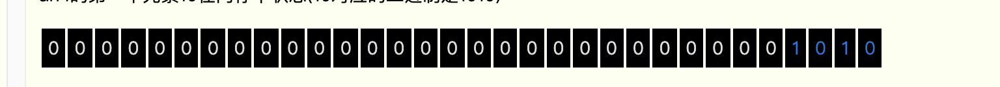
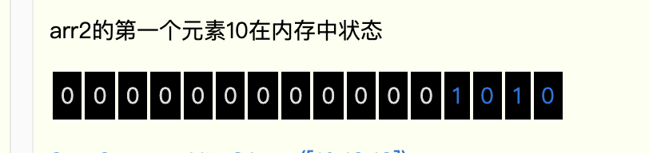
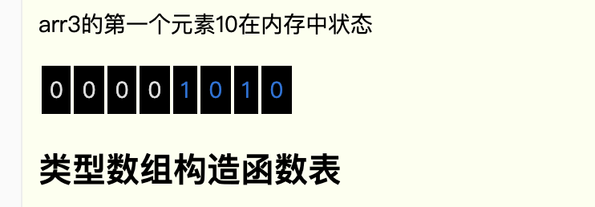
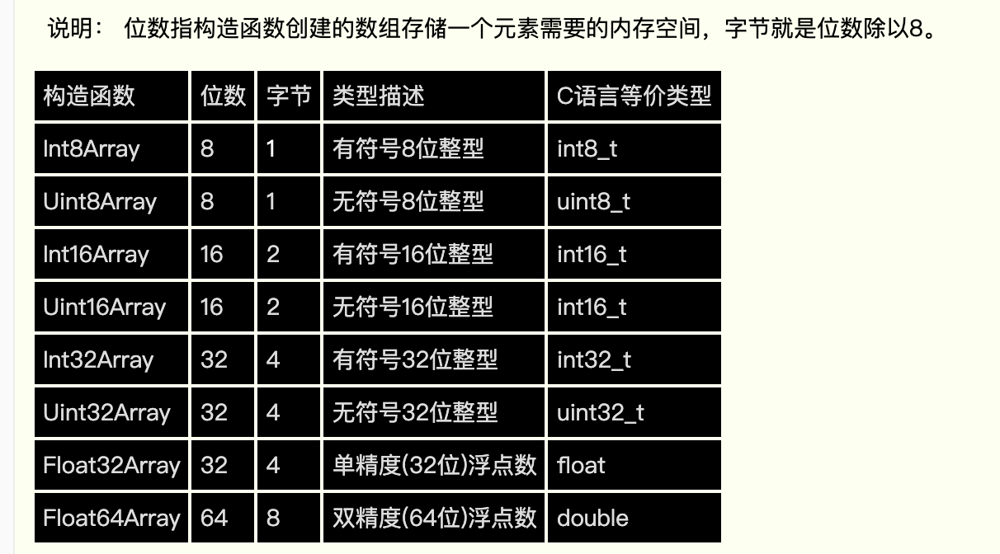
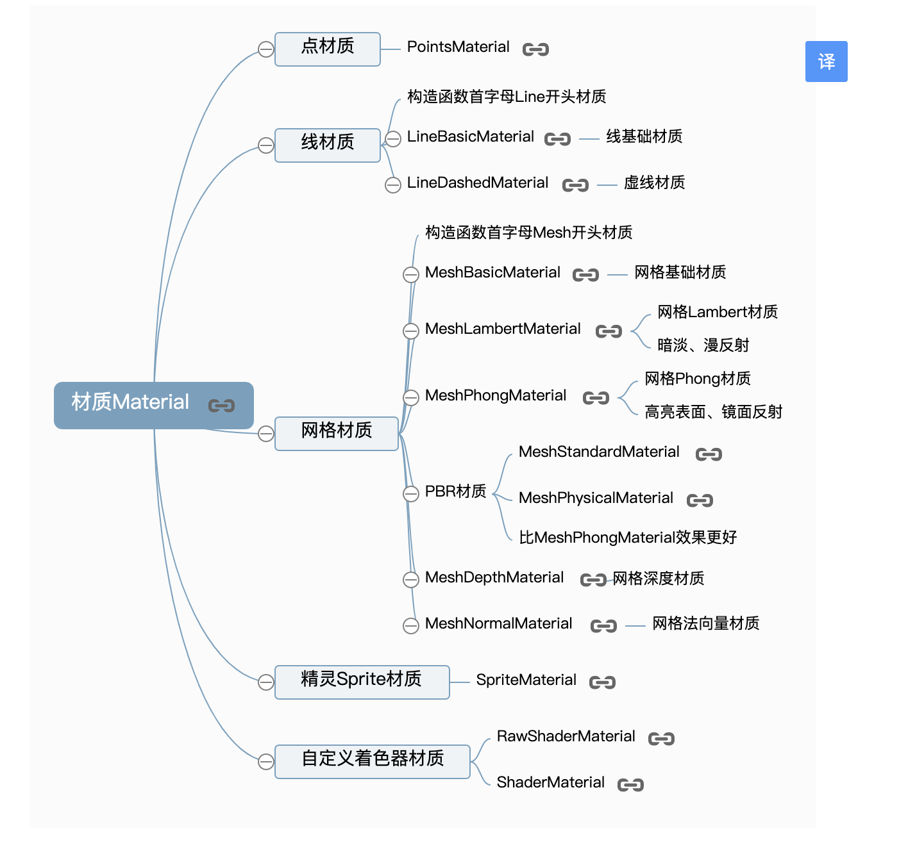
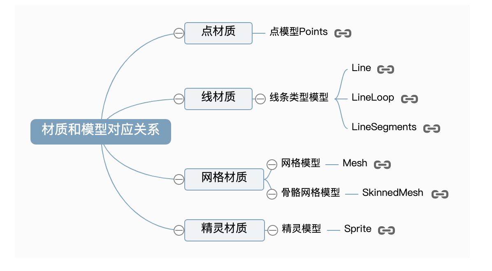
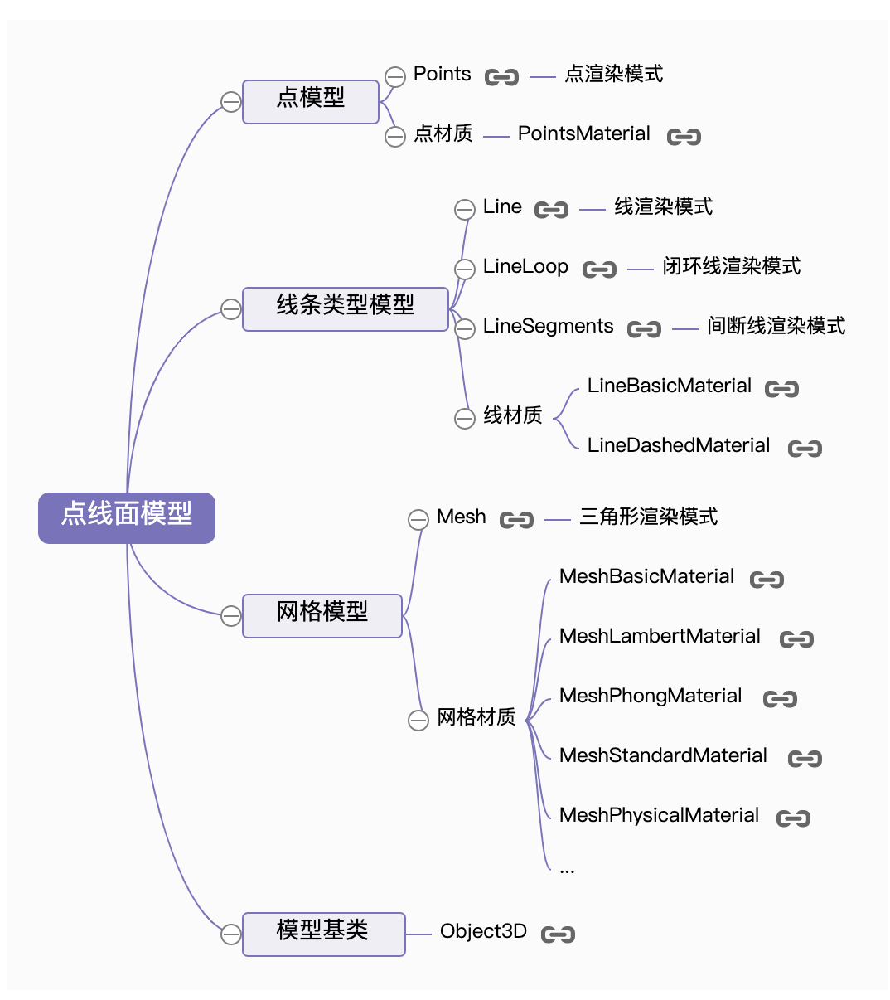
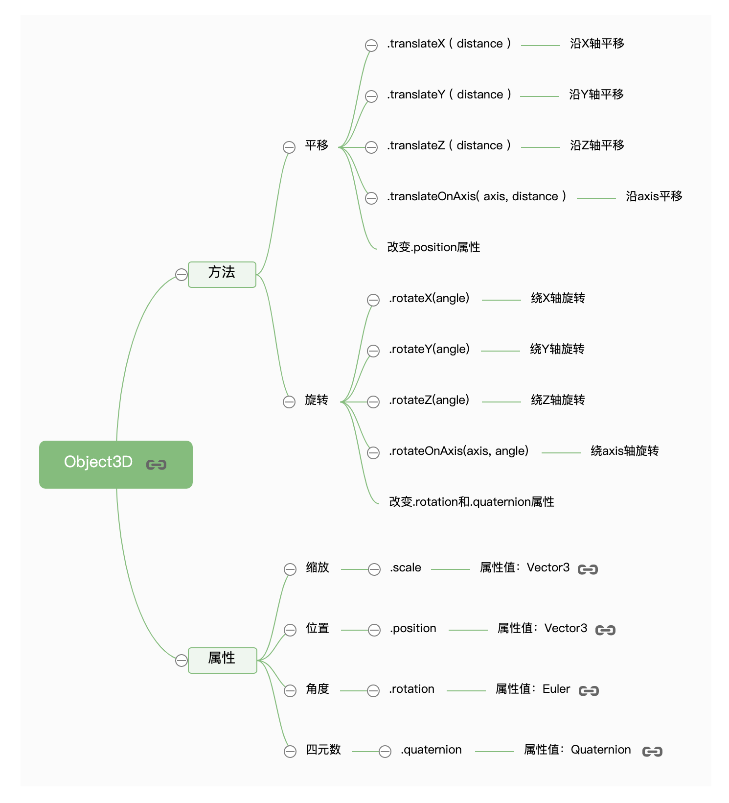

## Base

### 顶点概念

#### 类型数组

> 类型数组使用 int, unit[Bit]来表示，区别于普通数组。普通数组使用[]或 Array 构造创建.
>
> > 普通数组对待数字处理一般分为有符号 32 位整形数据和 64 位浮点数。类型数组之所以有类型这个定语，就是因为每一个构造函数对应一种 number 类型里面细分的数据类型。
>
> > Javascript 一般情况处理整数只有一种整型模式，一个整型数据分配 32 位内存空间， 类型数组中，构造函数 Int8Array()创建的数组每个元素占据的内存是 8 位，正如其名前半部分 Int8； Int16Array()创建数组的数字元素分配内存分配 16 位，诸如其他的构造函数 Float32Array 、 Float64Array、Int32Array 根据名字都知道它的元素类型和元素分配的内存空间。

#### 几种不同数组创建方式对应的内存分配图

1. [] 或 Array, 普通数组创建

```js
let arr = [10, 20, 30];
let arr2 = new Array(10, 20, 30);
```

数组元素内存分配，每一个元素占用 32 为内存空间.
如下，是数组 arr[0] = 10



2. arr2 = new Uint16Array([10,12,13]);

使用无符号 16 位类型数组创建数组，如下是 arr2[0] = 10 内存分配。


3. arr3 = new Uint8Array([10,12,13]);

使用无符号 8 位类型数组， 每一个数组元素分配 8 s 位内存空间


### 类型数组构造函数表



> Int 来自单词 integer 整数，无符号的 U 来自单词 Unsigned 无符号，整型对应的就是整数，浮点数你可以简单的理解位小数，整数分为整数有正数和负数之分。 无符号整数不能用来表示负数，内存的存储不要要符号位，有符号自然包括负数，**正数分配的最小存储单元第一位会用来作为符号位，0 表示正数，1 表示复数。**

### 类型数组属性

> 类型数组和普通数组一样都是对象，也一样具有属性，类型数组有些属性是独有属性，有些属性和普通数组一样

- BYTES_PER_ELEMENT, 获取类型数组元素占用内存空间

```js
let data1 = new Float32Array([0.4, 1.0, 0.4, 0.4, 1.0]);
let data2 = new Int16Array([4, 1, 4, 4, 1]);
let size1 = data1.BYTES_PER_ELEMENT; //返回结果size1为4
let size2 = data2.BYTES_PER_ELEMENT; //返回结果size2为2
```

- byteLength, 获取类型数组暂占用内存总数(Byte)

```js
let data1 = new Float32Array([0.4, 1.0, 0.4, 0.4, 1.0]);
let data2 = new Int16Array([4, 1, 4, 4, 1]);
let bL1 = data1.byteLength; //返回结果20
let bL2 = data2.byteLength; //返回结果10
```

- length, 获取类型数组对象内涵元素个数

```js
let data1 = new Float32Array([0.4, 1.0, 0.4, 0.4, 1.0]);
let data2 = new Int16Array([4, 1, 4, 4, 1]);
let L1 = data1.length; //返回结果5
let L2 = data2.length; //返回结果5
```

### 类型数组属性对照表

| 属性              | 含义                                         |
| ----------------- | -------------------------------------------- |
| BYTES-PER-ELEMENT | 构造函数创建的数组里面元素分配的字内存字节数 |
| bytelength        | 数组所有元素占用的内存空间，单位：字节 B     |
| length            | 数组内含元素个数                             |

### 类型数组方法

| 方法              | 含义                                                                                |
| ----------------- | ----------------------------------------------------------------------------------- |
| get(index)        | index 是整数值 0、1、2，表示类型数组元素的索引，执行方法返回索引 index 对应的元素值 |
| set(index, value) | 更改类型数组索引 index 对应的元素值为 value                                         |
| set(array,offset) | 给类型数组 array 插入元素，插入位置是偏移 offset 个元素                             |

### 类型数组视图内存分配对比


## 顶点

### 顶点法向量

### 漫反射，镜面反射.

> 漫反射，是投射在粗糙表面上的光向各个方向反射的现象。当一束平行的入射光线射到粗糙的表面时，表面会把光线向着四面八方反射，所以入射线虽然互相平行，由于各点的法线方向不一致，造成反射光线向不同的方向无规则地反射，这种反射称之为“漫反射”或“漫射”。这种反射的光称为漫射光。很多物体，如植物、墙壁、衣服等，其表面粗看起来似乎是平滑，但用放大镜仔细观察，就会看到其表面是凹凸不平的，所以本来是平行的太阳光被这些表面反射后，弥漫地射向不同方向

> 镜面反射是指若反射面比较光滑，当平行入射的光线射到这个反射面时，仍会平行地向一个方向反射出来，这种反射就属于镜面反射 [

> 法线（normal line），是指始终垂直于某平面的直线。在几何学中，法线指平面上垂直于曲线在某点的切线的一条线。法线也应用于光学的平面镜反射上。

> WebGl 中，为了计算光线与物体表面的入射角，需要先计算物体表面法向量。在 Threejs 中表示物体的网格模型 Mesh 的曲面是由一个一个三角形构成，所以为了表示物体表面各个位置的法线方向，可以给几何体的每个顶点定义一个方向向量。
> threejs 三维空间，物体坐标表示(y, z, x)

确认法向量过后，开始为场景加入光源。此时环境光和点光源都会参与光照计算。构建几何体表面的三角形整个表面比较明亮，同时两个三角形表面法线不同，即使光线方向相同，明暗自然不同，在分界位置有棱角感。

> 高光效果是镜面反射的形成。平行光线从入射到高光材质表面完全反射出去，材质表面表现高光效果。

### 顶点索引自定义实现立方体

> 通过缓冲几何体，自定义设置顶点数据，来实现几何体.

```js
let scene = new THREE.Scene();

let camera = new THREE.PerspectiveCamera(
  50,
  window.innerWidth / window.innerHeight,
  0.1,
  1000
);

camera.position.x = 200;
camera.position.y = 200;
camera.position.z = 200;

// 加入光源
let point = new THREE.PointLight(0xffffff);
point.position.set(300, 600, 400);
scene.add(point);

let ambient = new THREE.AmbientLight(0xbb7777);
scene.add(ambient);

let renderer = new THREE.WebGLRenderer();
renderer.setSize(window.innerWidth, window.innerHeight);
document.body.appendChild(renderer.domElement);

let geometry = new THREE.BufferGeometry(); // 空buffer几何体
console.log(geometry);
// 定义顶点数据

let vertices = new Float32Array([
  0,
  0,
  0,
  80,
  0,
  0,
  80,
  80,
  0,
  0,
  80,
  0, // y -> 轴面

  0,
  0,
  80,
  0,
  80,
  80, // x-> 轴面

  80,
  80,
  80, // x-y -> 轴

  80,
  0,
  80, // y->y 轴
]);
// 顶点法向量定义
// 法向量的点，是通过顶点做垂直于网格模型平面的垂直线.
let normals = new Float32Array([
  0, 0, 1, 0, 0, 1, 0, 0, 1, 0, 0, 1,

  0, 0, -1, 0, 0, -1, 0, 0, -1, 0, 0, -1,

  -1, 0, 0, -1, 0, 0, -1, 0, 0, -1, 0, 0,

  1, 0, 0, 1, 0, 0, 1, 0, 0, 1, 0, 0,

  0, 1, 0, 0, 1, 0, 0, 1, 0, 0, 1, 0,

  0, -1, 0, 0, -1, 0, 0, -1, 0, 0, -1, 0,
]);

let colors = new Float32Array([
  1,
  0,
  0, //顶点1颜色
  0,
  1,
  0, //顶点2颜色
  0,
  0,
  1, //顶点3颜色

  1,
  1,
  0, //顶点4颜色
  0,
  1,
  1, //顶点5颜色
  1,
  0,
  1, //顶 6

  1,
  0,
  0, //顶点1颜色
  0,
  1,
  0, //顶点2颜色
  0,
  0,
  1, //顶点3颜色

  1,
  1,
  0, //顶点4颜色
  0,
  1,
  1, //顶点5颜色
  1,
  0,
  1, //顶 6

  1,
  0,
  0, //顶点1颜色
  0,
  1,
  0, //顶点2颜色
  0,
  0,
  1, //顶点3颜色

  1,
  1,
  0, //顶点4颜色
  0,
  1,
  1, //顶点5颜色
  1,
  0,
  1, //顶 6

  1,
  0,
  0, //顶点1颜色
  0,
  1,
  0, //顶点2颜色
  0,
  0,
  1, //顶点3颜色

  1,
  1,
  0, //顶点4颜色
  0,
  1,
  1, //顶点5颜色
  1,
  0,
  1, //顶 6s
]);

// 定义顶点索引
let indexs = new Uint16Array([
  0, 1, 2, 0, 2, 3, 0, 4, 5, 0, 3, 5, 3, 2, 6, 3, 6, 5, 4, 5, 6, 4, 7, 6, 0, 3,
  7, 0, 4, 7, 0, 1, 7, 1, 2, 6, 1, 7, 6,
]);

geometry.setAttribute("position", new THREE.BufferAttribute(vertices, 3));
geometry.setAttribute("normal", new THREE.BufferAttribute(normals, 3));
//   geometry.setAttribute("color", new THREE.BufferAttribute(colors, 3));
geometry.index = new THREE.BufferAttribute(indexs, 1);
// 面渲染模型
// 定义材质
let material = new THREE.MeshPhongMaterial({
  // vertexColors: THREE.VertexColors,
  color: 0x777777,
  side: THREE.DoubleSide,
});

let mesh = new THREE.Mesh(geometry, material);
scene.add(mesh);

// 空间坐标辅助对象
let axesHelper = new THREE.AxesHelper(200);
scene.add(axesHelper);

function render() {
  requestAnimationFrame(render);
  renderer.render(scene, camera);
}
render();

let controls = new THREE.OrbitControls(camera, renderer.domElement);
controls.addEventListener("change", render);
```

::: tip 提示
通过 API` Gemotry`同样，也可以实现缓冲几何体.不过在 threejsr125 版本过后，已经移除对此 api 支持。
:::

### BufferGemotry 总结


### 几何体对象数据访问

> 包括，顶点，颜色，顶点法向量数据。threejs 内置的几何体模型，已经封装好，可以直接访问对象属性，查看属性。

#### 访问外部模型几何体顶点数据

> 实际开发项目的时候，可能会加载外部模型，有些时候需要获取模型几何体的顶点数据
> Threejs 加载外部模型的时候，会把几何体解析为缓冲类型几何体 BufferGeometry，所以访问外部模型几何体顶点数据

## 材质对象

> 材质对象是包含光照算法的 着色器 GLSL,ES 代码。目的在于赋予模型外观上的改变。比如模型的金属，透明度等模型外观。都是着色器的运用。为了方便开发 Threejs 提供了一系列的材质，所有材质就是对 WebGL 着色器代码的封装

**材质相关 API 总结**



### 材质对象和模型对象对应关系



## 模型对象

> 模型对象在 threejs 角度来说，就是有几何体与材质对象结合形成的三维对象。其中，材质设置三维模型外观形状，几何体则通过顶点坐标数据来表达三维模型外观形状。

**常用模型对象**

- Mesh,网格模型。
- Point,点模型
- Line, 线模型。



_Line,Mesh, Point 以及对应的材质都是由基类 BufferGeometry, Material 构成_

### 点模型

> 点模型就是几何体顶点数据所渲染的一个像素区域

### 线模型

> 通过顶点数据绘制线条

- Line, 线
- LineLoop, 首位相连线

### 网格模型

> 结合顶点数据，以三角形为基本平面绘制几何体

### 模型对象变换

> 点模型 Points、线模型 Line、网格网格模型 Mesh 等模型对象的基类都是 Object3D. 若想对模型对象平移变换,通过使用基类的集成属性或者方法操作.



#### 缩放变换- scale

> 模型对象的缩放属性`scale`,控制模型的缩放比列. 此属性的值是一个三维矢量数据。使用三维矢量构造 THREE.Vector3 来设置。三维矢量构造方法`set`用于更新三维矢量。

**scale**

```js
THREE.Vector3;
// 三个参数是向量三维空间坐标表示
set(x, y, z);

// 使用
mesh.scale.set(0.5, 1.5, 2);

/**
 * x轴缩放 0.5,
 * y轴缩放 1.5
 * z轴缩放 2
 *
 *
 */
```

**position**

> 模型位置.position 属性和.scale 属性的属性值一样也是三维向量对象 Vector3，通过模型位置属性.position 可以设置模型在场景 Scene 中的位置。模型位置.position 的默认值是 THREE.Vector3(0.0,0.0,0.0)。

```js
// 此位置设置模型在场景中的位置
// 设置模型xyz坐标;
mesh.position.set(80, 2, 10); // x-80, y-2, z- 10
```

**tranlate-X/Y/Z**

> 网格模型沿着 x 轴正方向平移 100，可以多次执行该语句，每次执行都是相对上一次的位置进行平移变换。

```js
// 等价于 mesh.position = mesh.position + 100;
mesh.translateX(100);//沿着 x 轴正方向平移距离 100
沿着 Z 轴负方向平移距离 50。

mesh.translateZ(-50);

//沿着自定义的方向移动。
//向量 Vector3 对象表示方向
var axis = new THREE.Vector3(1, 1, 1);
axis.normalize(); //向量归一化
//沿着 axis 轴表示方向平移 100
mesh.translateOnAxis(axis, 100);
```

::: tip 提示
执行.translateX()、.translateY()、.translateOnAxis()等方法本质上改变的都是模型的位置属性.position。
:::

**rotateX/Y/Z**

> 立方体网格模型绕立方体的 x/y/z 轴旋转 π/4，可以多次执行该语句，每次执行都是相对上一次的角度进行旋转变化

```js
// 绕x轴旋转 PI/4
mesh.rotateX(Math.PI / 4);

// 自定义旋转轴旋转
// 网格模型绕(0,1,0)向量表示的轴旋转π/8
var axis = new THREE.Vector3(0, 1, 0); //向量axis
mesh.rotateOnAxis(axis, Math.PI / 8); //绕axis轴旋转π/8

// 绕着Y轴旋转90度
mesh.rotateY(Math.PI / 2);
//控制台查看：旋转方法，改变了rotation属性
console.log(mesh.rotation);
```

::: tip 提示
执行旋转.rotateX()等方法和执行平移.translateY()等方法一样都是对模型状态属性的改变，区别在于执行平移方法改变的是模型的位置属性.position，执行模型的旋转方法改变的是表示模型角度状态的角度属性.rotation 或者四元数属性.quaternion。

模型的角度属性.rotation 和四元数属性.quaternion 都是表示模型的角度状态，只是表示方法不同，.rotation 属性值是欧拉对象 Euler,.quaternion 属性值是是四元数对象 Quaternion
:::

**旋转属性总结**

- rotation, 模型的角度属性
- quaternion, 四元数属性
- rotateX/Y/Z, 控制模型旋转

## 光源对象

> threejs 三维场景对象`Scene`主要由，模型对象和光源对象构成.


### 各常见光源对象实践

> threejs 虚拟光源是对自然界光源的模糊，为了更好渲染虚拟场景，需要设置好光源.

- **环境光**

> 环境光即是自然光的模拟.环境光照射在物体表面时，物体表面各个方向的明暗程度一致.

::: tip 提示
环境光的颜色计算方式是和物体的材质颜色相乘计算的。
:::

- **点光源**

> 点光源模拟，类似生活中的白炽灯。光线从光源核心处向外扩散。当光线投射到物体平面时，光线与物体表面的入射角不一致。因此物体表面的明暗程度也就不相同；同时也受远近影响光线衰弱程度不同。
> 与平行光不同，在使用点光源时，需要设置 Light 的位置`position`属性。

- **平行光**

> 平行光顾名思义光线平行，对于一个平面而言，平面不同区域接收到平行光的入射角一样。点光源因为是向四周发散，所以设置好位置属性.position 就可以确定光线和物体表面的夹角，对于平行光而言,主要是确定光线的方向,光线方向设定好了，光线的与物体表面入射角就确定了，仅仅设置光线位置是不起作用的。
> 在三维空间中为了确定一条直线的方向只需要确定直线上两个点的坐标即可，所以 Threejs 平行光提供了位置.position 和目标.target 两个属性来一起确定平行光方向
> 目标.target 的属性值可以是 Threejs 场景中任何一个三维模型对象，比如一个网格模型 Mesh，这样 Threejs 计算平行光照射方向的时候，会通过自身位置属性.position 和.target 表示的物体的位置属性.position 计算出来。

_平行光如果不设置.position 和.target 属性，光线默认从上往下照射，也就是可以认为(0,1,0)和(0,0,0)两个坐标确定的光线方向。_

::: tip 提示
平行光的`position`属性并不表示物体的发射起点。而是用来确定光线的方向用的。平行光的发射起点可以从太阳光想象，即是从远处沿指定方向投射来。
:::

- **聚光灯**

> 聚光源可以认为是一个沿着特定方会逐渐发散的光源，照射范围在三维空间中构成一个圆锥体。通过属性.angle 可以设置聚光源发散角度，聚光源照射方向设置和平行光光源一样是通过位置.position 和目标.target 两个属性来实现。

### **光源辅助对象**

| 辅助对象       | 构造              |
| -------------- | ----------------- |
| 聚光源辅助     | SpotLightHelper   |
| 点光源辅助     | PointLightHelper  |
| 平行光光源辅助 | DirectionalHelper |

### 光照计算算法

> Threejs 在渲染的时候网格模型材质的颜色值 mesh.material.color 和光源的颜色值 light.color 会进行相乘，简单说就是 RGB 三个分量分别相乘。
> 数学模型为: 漫反射光的颜色 = 网格模型材质颜色值 x 光线颜色 x 光线入射角余弦值
> 光照颜色计算最后颜色，就是光线透过物体，反射后的颜色。也就是最终反馈给肉眼的颜色。

_漫反射颜色计算公式: (R2, G2, B2) = (R1, G1, B1) x (R0, G0, B0) x cosθ_

```js
R2 = R1 * R0 * cosθ;
G2 = G1 * G0 * cosθ;
B2 = B1 * B0 * cosθ;
```

::: tip 提示
白色可以反射任意光线。材质本身颜色。并不是真正反馈给肉眼的，而是通过光线反馈给肉眼。比如一个黑色的物体，在蓝色光线下，会表现蓝色效果。
:::

## 相机

相关概念:

[透视与正交](https://blog.csdn.net/zipack/article/details/114384862)
